# Hi there!, I'm Ghislain👋🏼:

## 👀 Profile Views

# 💫 About Me:
- I'm a junior fullstack engineer fueled by curiosity and my passion for technology and innovation.
- I thrive in collaborative environments where ideas are shared and solutions are built together.
- I love crafting secured, efficient, and scalable solutions.
- Every challenge is an opportunity to learn and grow.

## 🌐 Connect with Me

# 💻 Tech Stack:
     

# 📊 GitHub Stats:
 
 

## 🏆 GitHub Trophies

## 🏆 Achievements

### ✍️ Motivation Dev Quote

---

<picture>
  <source media="(prefers-color-scheme: dark)" srcset="https://raw.githubusercontent.com/Guy-Ghis/Guy-Ghis/output/github-snake-dark.svg" />
  <source media="(prefers-color-scheme: light)" srcset="https://raw.githubusercontent.com/Guy-Ghis/Guy-Ghis/output/github-snake.svg" />
  
</picture>
